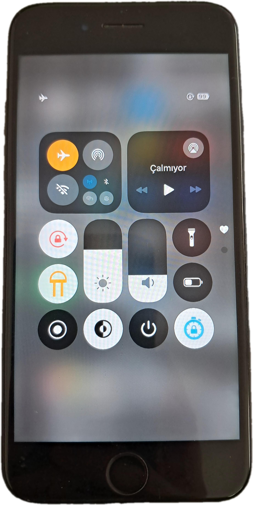
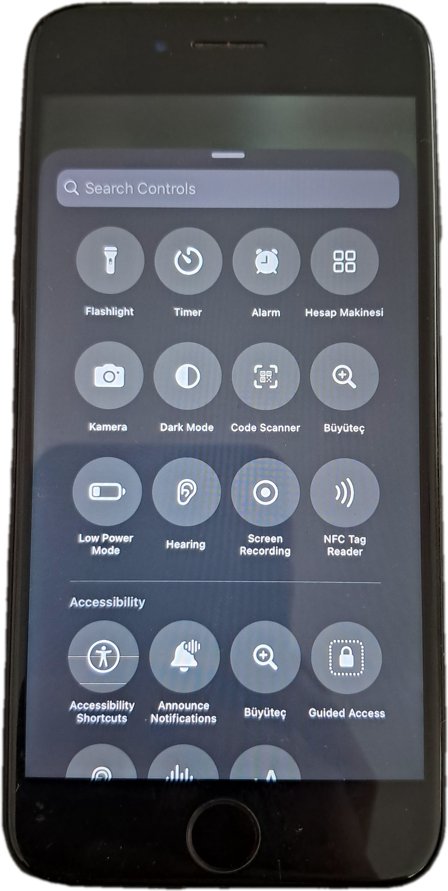
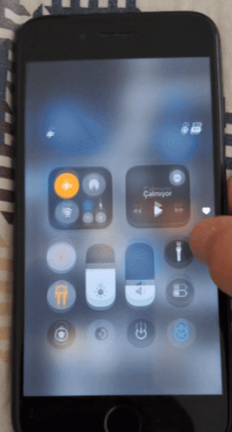

# CCAster

CCAster is an iOS 18-inspired, editable Control Center experience for jailbroken iOS 15 devices.

This project is a compatibility-focused continuation of CCAster for iOS 15, bringing the modern paged and customizable Control Center experience to older devices.

<p align="center">
  
  
  
</p>

## ✨ Features

- Editable module layout
- Paged Control Center
- Custom add-control sheet
- Resizable modules
- Custom module footprints
- Rootless jailbreak support
- Improved compatibility with iOS 15

## 📱 Compatibility

### Tested

- **iPhone 7 — iOS 15.8.7** ✅

### Unknown

- iOS 11–14 ❓
- Other devices / iOS 15 versions ❓

### iOS 16

For the original iOS 16 version of CCAster, visit the
[original CCAster repository](https://github.com/MoarTweaks/CCAster).

## 🔨 Building

CCAster is a rootless Theos project.

### Requirements

- Theos
- ElleKit
- PreferenceLoader

### Build

Run the following command from the project directory:

```sh
env CLANG_MODULE_CACHE_PATH=/tmp/clang-module-cache SWIFT_MODULE_CACHE_PATH=/tmp/swift-module-cache make clean package FINALPACKAGE=1
```

The resulting `.deb` package will be generated by Theos.

## 📦 Package Information

- **Package ID:** `com.futur3sn0w.ccaster`
- **Injection Target:** SpringBoard
- **Dependencies:** ElleKit, PreferenceLoader

## 📁 Project Structure

- `Tweak.xm` — SpringBoard hooks, Control Center logic, layout engine, edit mode, add sheet and module presentation
- `prefs/` — PreferenceLoader bundle
- `scripts/` — Development and testing helpers

## 🧩 COSMIC Kit

CCAster can work with [COSMIC Kit](https://github.com/MoarTweaks/CCAster), a companion package providing optional Control Center modules.

The projects have separate responsibilities:

- **CCAster** — Control Center UI, layout, editing, paging, resizing and runtime integration
- **COSMIC Kit** — Optional Control Center module bundles

This separation allows additional modules to be developed independently from the CCAster core.

## 🙌 Credits

- **[MoarTweaks](https://github.com/MoarTweaks/CCAster)** (futur3sn0w) — original creator of CCAster.
- **[notsoseagatey](https://github.com/notsoseagatey)** — ported CCAster to iOS 15.
- **[Tuna](https://github.com/HaydarReiss31)** — performance and stability fixes for this build (see Changelog below).

## 📝 Changelog

**v0.2.4**
- Fixed a dangling-pointer crash risk in the connectivity card's expand/collapse system.

**v0.2.3**
- Fixed edit-mode chrome updating continuously at 60fps even while idle.
- Fixed module edit borders reallocating a new mask layer on every frame.
- Fixed severe lag while dragging the volume/brightness sliders, which could freeze the device and crash SpringBoard.

See the Releases page for full details on each version.

## ⚠️ Known Issues

- The connectivity card can briefly flash blank or show visual artifacts when expanding/collapsing. Cosmetic only — self-resolves within a second or two, does not crash.

## ⚠️ Status

CCAster is still under active development.

Because the tweak relies on Apple's private Control Center frameworks, compatibility may vary between devices and iOS versions.

If you encounter a problem, please include:

- Device model
- iOS version
- Jailbreak used
- Relevant logs or crash reports
- Steps to reproduce the issue

## 🤝 Contributing

Compatibility testing, bug reports and pull requests are welcome.

If you test CCAster on another device or iOS version, please report your results.

## ⭐ Support

If CCAster is useful to you, consider giving the repository a star.

It helps other jailbreak users discover the project.

## 🤖 Development Note

CCAster was developed with AI assistance.
